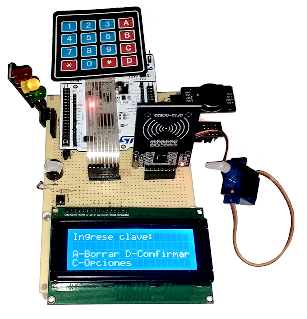

# TdSE - TP Final
Trabajo Práctico Integrador para la materia Taller de Sistemas Embebidos (TA134) - Curso 2, Grupo 02.

- El proyecto consiste en un sistema de control de acceso mediante cerradura electrónica, con leds indicadores, buzzer de alarma, y posibilidad de ingresar mediante clave numérica o tarjeta/llavero.

- El mismo fue realizado en STM32CubeIDE y se utilizó la placa de desarrollo NUCLEO-F103RB.

## Proyecto
Contiene:
- El proyecto de STM32CubeIDE.

## Recursos
Contiene:
- Información del trabajo (informes).
- Recursos adicionales a utilizar en el proyecto.